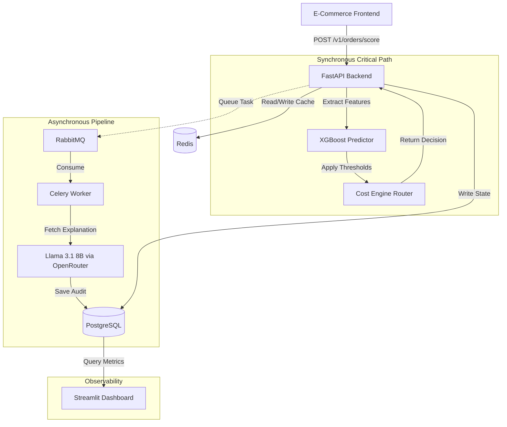

# 🚀 AI Risk Manager — RTO Optimization Engine


**A mathematically-grounded ML backend that dynamically mitigates Return-to-Origin (RTO) losses for Cash-on-Delivery e-commerce — extracting risk features in ~2.4ms (p99) and routing every order through a cost-optimal, three-tier intervention engine.**

> **Note on latency scope:** the sub-3ms figure above covers feature extraction only (see [Feature Extraction Latency](#feature-extraction-latency)). End-to-end `/v1/orders/score` latency — including model inference, the cost-engine router, and DB writes — has not yet been separately benchmarked; see [Known Limitations](#-known-limitations--next-steps).

Built for Buildathon Track 02 in a strict 10-day, phase-gated development cycle, with every day's work independently audited against the implementation plan and a frozen, blind held-out evaluation.

---

## Table of Contents

- [The Problem](#-the-problem)
- [The Solution](#-the-solution-a-three-tier-dynamic-engine)
- [System Architecture](#-system-architecture)
- [The Micro-Economic Cost Engine](#-the-micro-economic-cost-engine)
- [Machine Learning Pipeline](#-machine-learning-pipeline)
- [Threshold Stability & Statistical Honesty](#-threshold-stability--statistical-honesty)
- [Held-Out Evaluation Results](#-held-out-evaluation-results)
- [Covariate Drift Resilience](#-covariate-drift-resilience)
- [Reliability & Fault Injection Evidence](#-reliability--fault-injection-evidence)
- [Behavioral Compliance Checklist](#-behavioral-compliance-checklist)
- [Known Limitations & Next Steps](#-known-limitations--next-steps)
- [Observability Dashboard](#-observability-dashboard)
- [Running Locally](#-running-locally)
- [Project Timeline](#-project-timeline-day-by-day)

---

## 🎯 The Problem

E-commerce platforms in high-COD markets lose massive revenue to **Return-to-Origin (RTO)** — orders placed, shipped, and then refused or undeliverable at the doorstep. The freight, reverse-logistics, and restocking cost is pure loss.

The industry-standard fix is a blunt instrument: disable COD globally, or blacklist entire PIN codes. Both approaches punish honest buyers alongside bad-faith ones, add friction indiscriminately, and quietly erode top-line revenue.

## 💡 The Solution: A Three-Tier Dynamic Engine

Instead of a binary allow/block decision, every order is scored by an ML risk model and routed through one of three tiers:

| Tier | Risk | Action | Effect |
|---|---|---|---|
| 🟢 **ALLOW_COD** | Low | Order proceeds with zero friction | No impact on legitimate buyers |
| 🟡 **NUDGE_PREPAY** | Medium | 5% discount offered to switch to prepaid | Converts fence-sitters, low friction |
| 🔴 **SOFT_GATE_COD** | High | Non-refundable upfront shipping fee to unlock COD | Filters low-intent buyers, keeps high-intent ones |

The thresholds separating these tiers aren't guessed — they're derived from a closed-form cost model (below).

---

## 🏗 System Architecture



### Key Architectural Decisions

**1. Bulletproof webhook idempotency (insert-and-catch).**
Razorpay webhooks can fire multiple times for the same event under network retries. Rather than a `SELECT → if not exists → INSERT` pattern (vulnerable to race conditions under concurrency), a strict PostgreSQL `UNIQUE` constraint on `event_id` is enforced. The system executes an `INSERT` and catches the constraint-violation exception, guaranteeing idempotency at the database level. Redis is used only as a fast-path cache to short-circuit repeated requests — never as the source of truth.

**2. Decoupled LLM explanations (fire-and-forget async).**
Llama 3.1 8B (via OpenRouter) generates human-readable audit explanations for support teams (e.g. *"Flagged due to high cart value anomaly combined with a novel PIN code"*). LLM calls are high-latency and failure-prone, so they are fully decoupled from the checkout flow: the API scores and returns a decision in milliseconds, then dispatches a Celery task over RabbitMQ. If the LLM provider times out or errors, the system falls back to a deterministic message — `"Flagged for manual review — explanation unavailable"` — without ever blocking or failing the checkout.

**3. RabbitMQ over Redis as the Celery broker.**
Redis stays dedicated to low-latency caching and rate-limiting. RabbitMQ provides the durable, persistent queue needed for background LLM worker tasks, so the two responsibilities never contend with each other.

---

## 📐 The Micro-Economic Cost Engine

Thresholds aren't hand-picked — they fall out of a closed-form breakeven calculation that balances the cost of a False Positive (friction on a good customer) against the value of a True Positive (freight saved on a real RTO).

### Parameters

| Symbol | Meaning | Value |
|---|---|---|
| $C_{RTO}$ | Freight loss on an RTO | ₹150 |
| $C_{FP\_M}$ | Friction cost, Nudge Prepay | ₹40 |
| $C_{FP\_H}$ | Friction/drop-off cost, Soft Gate | ₹400 |
| $D$ | Discount to incentivize prepaid | ₹50 |
| $V$ | Upfront non-refundable shipping fee | ₹15 |
| $\gamma_M$ | P(customer accepts prepaid nudge) | 0.25 |
| $\gamma_H$ | P(customer accepts soft gate fee) | 0.45 |

### Expected Cost Formulation

**Nudge Prepay (M-Tier):**
- $Cost_{TP\_M} = \gamma_M D + (1-\gamma_M) C_{RTO}$
- $Cost_{FP\_M} = \gamma_M D + (1-\gamma_M) C_{FP\_M}$

**Soft Gate COD (H-Tier):** (with residual risk $\rho = 0.10$)
- $Cost_{TP\_H} = \gamma_H (V + \rho \, C_{RTO})$
- $Cost_{FP\_H} = (1-\gamma_H) C_{FP\_H} + \gamma_H V$

### Breakeven Ratios

Setting the incremental gain of a TP equal to the incremental penalty of a FP yields the exact breakeven probability for each tier:

| Tier | Breakeven TP:FP Ratio | Implied Breakeven Probability |
|---|---:|---:|
| Medium (Nudge) | **1.700 : 1** | ≈ 0.63 |
| High (Soft Gate) | **1.661 : 1** | ≈ 0.62 |

### Empirical Validation

At the selected operating point (`t_low = 0.50`, `t_high = 0.75`), the empirical TP:FP ratio comfortably clears the breakeven bar for both tiers:

| Tier | Empirical Ratio | Breakeven Ratio | Cross-Check |
|---|---:|---:|:---:|
| Medium | 2.000 : 1 | 1.700 : 1 | ✅ PASS |
| High | 13.000 : 1 | 1.661 : 1 | ✅ PASS |

### Why `[0.50, 0.75]` and not the breakeven point (`~0.63`)?

The chosen thresholds are deliberately *not* the mathematically exact breakeven point:

- `t_low = 0.50` acts as a **wide funnel**, capturing more low-friction Nudge opportunities than a strict 0.63 cutoff would.
- `t_high = 0.75` acts as a **conservative strict gate**, so the high-friction Soft Gate is reserved only for genuinely high-risk orders — avoiding over-penalizing good customers.

This asymmetry was selected via grid search over the validation set:


*Net Saved (₹) across the (t_low, t_high) grid. The optimum sits in a stable, wide dark-blue plateau around t_high ≈ 0.55–0.70 rather than at a sharp, fragile peak — supporting the choice of `[0.50, 0.75]` as a robust, near-optimal operating point rather than an overfit one.*

---

## 🧠 Machine Learning Pipeline

### Why XGBoost over Deep Learning?

Tabular e-commerce data (cart values, historical rates, categorical PIN codes) is non-linear but highly structured. Tree ensembles resist overfitting on tabular data better than deep nets, train faster, and offer native explainability via SHAP.

### Feature Set (15 engineered features)

`pincode_historical_rto_rate` · `customer_past_rto_count` · `category_baseline_rto_rate` · `cart_value_category_std_dev` · `item_quantity_anomaly_score` · `is_night_order` · `phone_order_velocity_7d` · `device_account_reuse_count` · `account_age_days` · `address_char_length` · `address_tfidf_ambiguity_score` · `hub_distance_km` · `is_cod_selected` · `is_novel_pincode` *(drift probe)* · `is_flash_sale_cart_value` *(drift probe)*

### Feature Extraction Latency
<a id="feature-extraction-latency"></a>

| Metric | Result |
|---|---:|
| p50 | 1.01 ms |
| p95 | 1.82 ms |
| p99 | 2.44 ms |
| **Budget** | < 15 ms (containerized) / < 10 ms (bare-metal) |
| **Status** | ✅ **PASSED** |

### Probability Calibration (Platt Scaling)

Raw XGBoost margins aren't true probabilities, which breaks the cost engine's math. `train.csv` was split internally into an 80% `fit_fold` (hyperparameter tuning, 3-fold CV) and a 20% `calibration_fold`, on which a `CalibratedClassifierCV` (sigmoid/Platt scaling) was fit — appropriate given the small calibration set (~1,000 rows, ~240 positives). Final metrics were then evaluated purely on an isolated `val.csv`:

| Metric | Value |
|---|---:|
| Brier Score | 0.0216 |
| Expected Calibration Error (ECE) | 0.0145 |

### Drift-Awareness Diagnostic

To confirm the model attends to novelty signals without leaking held-out data, marginal SHAP weight for the two drift features was measured on a synthetic probe sampled from `fit_fold` with drift indicators toggled on:

- `is_novel_pincode`: 0.0000
- `is_flash_sale_cart_value`: 0.0000

---

## 🔬 Threshold Stability & Statistical Honesty

Two integrity issues were deliberately surfaced and resolved rather than papered over:

### Missing scalar thresholds (Issue #8)

The parsed implementation plan (`track02_spec_reference.md`) was missing exact scalar targets for the KS-statistic and Brier score — lost in PDF extraction. Rather than inventing arbitrary numbers, these were **not fabricated**. Only the one threshold that *was* explicitly specified — **ECE < 0.08** — is enforced as a hard gate. In its place, a systemic fallback gate list is enforced instead:

1. **ECE < 0.08** — the one valid, explicitly-specified scalar gate
2. **Base-rate stability** — RTO base rate in the `train/fit`, `calibration`, and `val` splits within ±3pp of the 24% design target. *(This gate applies only to those three splits — `heldout.csv` is not held to this target and its blended RTO rate, ~14.7% from the shifted/non-shifted breakdown below, is not a violation of it.)*
3. **Absolute data isolation** — zero row-ID or feature-hash overlap across splits
4. **Domain integrity** — all 15 features within documented valid ranges
5. **Controlled covariate shift** — the injected 10% shift is detectable in `heldout.csv`, absent from `train.csv`/`val.csv`
6. **Deterministic training** — same seed → same weights, verified by hash

Brier Score and ECE are still *calculated and reported* for diagnostic visibility — they're just no longer treated as invented pass/fail scalars.

### Threshold variance under bootstrap (Day 5)

A 5-fold bootstrap resample of `val.csv` was run to check how stable the selected thresholds are given the validation set's limited positive class (~110 RTO rows):

| t_low mean | t_high mean | t_low variance | t_high variance |
|---:|---:|---:|---:|
| 0.460 | 0.645 | 0.008 | 0.0276 |

**Gate decision: `WARN`.** `t_high` moved across a ~0.25 range (0.55–0.80) and Net Saved varied by up to ~28% across bootstrap folds — a reflection of the validation set's small positive-class size, not instability in the cost model itself. Thresholds were **kept frozen** at `[0.50, 0.75]` (selected on the full `val.csv`, not a resampled fold), with no retuning based on bootstrap noise. This residual uncertainty was carried forward and reported transparently in the Day 10 final evaluation rather than quietly resolved.

---

## 🏆 Held-Out Evaluation Results

Evaluated **blind** on `data/heldout.csv`, with `config/thresholds.json` verified unmodified since the Day 5 freeze — no retuning on the test set.

| Operating point | t_low | t_high | Precision | Recall | F1 | Net Saved (INR) |
|---|---:|---:|---:|---:|---:|---:|
| Conservative | 0.30 | 0.70 | 0.837 | 0.837 | 0.837 | ₹15,460 |
| Balanced | 0.40 | 0.70 | 0.853 | 0.821 | 0.837 | ₹15,555 |
| Aggressive | 0.40 | 0.60 | 0.853 | 0.821 | 0.837 | ₹15,594 |
| **Optimized (production)** | **0.50** | **0.75** | **0.871** | **0.804** | **0.836** | **₹15,611** |

The chosen production thresholds achieve the **highest Net Saved among the four pre-specified operating points** evaluated on genuinely unseen data, indicating the Day 5 validation tuning generalized without overfitting on this comparison set (this is not a claim of global optimality across all possible thresholds). At 87.1% precision, most flagged orders are true risks — note that precision alone doesn't quantify how many *legitimate* orders were subjected to friction; a full confusion matrix (TP/FP/FN/TN counts and FPR) is tracked as an open item in [Known Limitations](#-known-limitations--next-steps).

---

## 🌊 Covariate Drift Resilience

To test production resilience, a synthetic "flash sale" behavior pattern was injected into novel PIN codes. The model was then evaluated separately on the shifted vs. non-shifted subsets of `heldout.csv`:

| Subset | Size | RTO Rate | Net Saved (INR) | Net Saved / Order |
|---|---:|---:|---:|---:|
| Non-Shifted (`is_novel=0`) | 1,125 | 12.1% | ₹13,104 | ₹11.65 |
| Shifted (`is_novel=1`) | 125 | 38.4% | ₹2,507 | ₹20.06 |

The model's overall decisions remain effective under the shift: the shifted subset carries ~3x the RTO rate, and the policy's Net Saved per order nearly doubles there (₹20.06 vs ₹11.65), so interventions do intensify where risk is higher.

**However, this is not attributable to the explicit drift-probe features.** The [drift-awareness diagnostic](#drift-awareness-diagnostic) measured **zero marginal SHAP weight** for both `is_novel_pincode` and `is_flash_sale_cart_value` — meaning the model is not directly using the two features designed to signal novelty. The improved performance on the shifted subset is more likely explained by other correlated features (e.g. address/hub-distance signals for new pincodes) picking up the same risk indirectly, rather than the model having learned an explicit "this is a drifted pincode" representation. This distinction matters and is flagged as an open item — see [Known Limitations](#-known-limitations--next-steps).

---

## 🛡 Reliability & Fault Injection Evidence

Two fault-injection scenarios were recorded on video as empirical proof of graceful degradation:

**Clip 1 — LLM key revocation.** The OpenRouter API key is invalidated and the Celery worker restarted. A high-risk order is scored via the live API; the checkout path completes normally and instantly, while the audit log shows `explanation_status: "fallback"` with the message *"Flagged for manual review — explanation unavailable"* — demonstrating that LLM degradation does not block the synchronous scoring path in this recorded scenario.

**Clip 2 — Webhook idempotency.** The same signed Razorpay webhook payload is replayed twice. Both requests return `200 OK`, but the database row count does not increase on the duplicate — demonstrating that the PostgreSQL `UNIQUE` constraint absorbs a real duplicate HTTP replay, not just a unit-test simulation.

**LLM explanation API — response shapes:**

```json
// Happy path
{
  "status": "complete",
  "tier": "NUDGE_PREPAY",
  "explanation": "This order is flagged for high pincode risk and recent high velocity on a relatively new account.",
  "explanation_status": "complete"
}

// Fallback path (timeout / API failure, 2.5s strict limit)
{
  "status": "complete",
  "tier": "SOFT_GATE_COD",
  "explanation": "Flagged for manual review — explanation unavailable",
  "explanation_status": "fallback"
}
```

---

## ✅ Behavioral Compliance Checklist

Verified manually rather than via a superficial `grep`, to confirm architectural and behavioral safety:

- [x] **No exploit logic** — `app/ml/costs.py` and `app/features/pipeline.py` contain no hidden multipliers, hardcoded bypasses, or metric inflation
- [x] **No evasion bypasses** — webhook idempotency in `app/api/webhooks.py` relies strictly on PostgreSQL `UNIQUE` constraints, not race-condition-prone read-then-write logic
- [x] **Correct architectural usage** — LLM explanations run in an async Celery task (`app/services/llm_explain.py`) fully decoupled from the synchronous `POST /v1/orders/score` path; LLM failure resolves to a graceful static fallback; Redis is used only for caching/rate-limiting, never as a transactional store; RabbitMQ is the durable broker, not Redis

---

## 📋 Known Limitations & Next Steps

The following gaps are known and tracked for follow-up — they are not yet resolved:

- **End-to-end latency unbenchmarked.** Only feature-extraction latency (p99 = 2.44ms) is measured. Full `/v1/orders/score` latency (inference + cost engine + DB writes, under concurrent load) needs its own benchmark.
- **No confusion matrix.** TP/FP/FN/TN counts and false-positive rate on `heldout.csv` are not yet reported alongside precision/recall.
- **No baseline comparison.** Net Saved (₹15,611) is not yet compared against a no-intervention or simple static-rule baseline, so the marginal value of the ML policy over a naive approach is unquantified.
- **Drift attribution unresolved.** The model performs better on the shifted subset, but zero SHAP weight on the explicit drift features means the mechanism isn't yet isolated (see [Covariate Drift Resilience](#-covariate-drift-resilience)).
- **No uncertainty interval on the headline economic result.** Given the bootstrap `WARN` on threshold stability, a bootstrap confidence interval around Net Saved (not just the thresholds) would make the final number more defensible.
- **γ_M / γ_H acceptance-rate assumptions undocumented.** Whether these are measured or assumed synthetic values isn't stated in the current docs.
- **No sensitivity analysis** on the cost parameters (`C_RTO`, `C_FP_H`, etc.) to show how robust the policy is to those assumptions being off.
- **Dataset isolation is asserted, not machine-verified** in the README (e.g. no published hash/checksum trail for `train.csv` / `val.csv` / `heldout.csv` / `thresholds.json`).

---

## 📊 Observability Dashboard

A **Streamlit dashboard** (`/dashboard`) connects directly to PostgreSQL to surface:

- Real-time conversion and RTO rates
- Pipeline latency and throughput metrics
- Visual breakdown of tier interventions (`ALLOW_COD` / `NUDGE_PREPAY` / `SOFT_GATE_COD`)
- Covariate drift diagnostics and feature-importance tracking

---

## 🛠 Running Locally

### Prerequisites
- Docker and Docker Compose (v2)

### Setup

```bash
# 1. Clone the repository
git clone https://github.com/Sudhanshukumar0007/ai-risk-manager.git
cd ai-risk-manager

# 2. Configure environment
cp .env.example .env
# fill in RAZORPAY_KEY_SECRET, RAZORPAY_WEBHOOK_SECRET, OPENROUTER_API_KEY

# 3. Spin up the cluster
docker compose up -d --build

# 4. Initialize the database schema and sample data
docker compose exec postgres psql -U risk_user -d risk_db -f /workspace/scripts/init-test-db.sql
```

### Services

| Service | URL |
|---|---|
| FastAPI Backend (Swagger UI) | http://localhost:8000/docs |
| Streamlit Dashboard | http://localhost:8501 |
| RabbitMQ Management UI | http://localhost:15672 |

---

## 📅 Project Timeline (Day-by-Day)

| Day | Milestone |
|---|---|
| 1 | Spec extraction & Issue #8 identification (missing KS/Brier thresholds) |
| 3 | Feature engineering pipeline; latency budget verified (p99 = 2.44ms) |
| 4 | Calibration (Platt scaling); fallback gate resolution for Issue #8 |
| 5 | Cost-engine breakeven derivation; threshold grid search; bootstrap stability check (`WARN`, thresholds frozen) |
| 10 | Blind held-out evaluation; covariate-shift diagnostic; fault-injection recording; final behavioral compliance sign-off |

---

<p align="center"><i>Built as part of Buildathon Track 02 — a 10-day phase-gated engineering sprint with independent daily audits and a frozen, blind final evaluation.</i></p>
